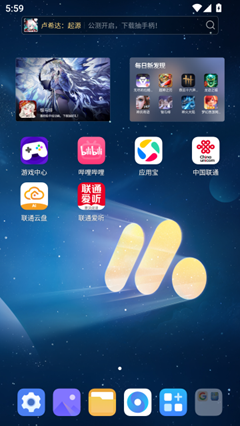

[README.md](https://github.com/user-attachments/files/21789384/README.md)
## 概述
·高质量GUI Grounding：通过在大规模中英文Android数据集上进行预训练，有效提升了对常见GUI控件（如按钮、输入框、标签、图标等）的定位与理解能力；

·增强的规划推理能力：通过强化微调技术（RFT），让模型输出动作前进行推理思考，有效提升复杂任务执行的成功率；

·紧凑的动作空间设计：采用优化的动作空间和紧凑的JSON格式

·添加硬件外设：基于多轴机械臂与ADB控制，实现真实手机操作（如点击、滑动），并通过视觉-运动校准确保动作精度。

## 任务示例
硬件：
[▶ 播放硬件示例视频](硬件示例视频.mp4)

## 快速开始
提供了AI+手机和含有外接硬件的两种方案
### 安装依赖

```bash
cd AgentCPM-GUI
conda create -n gui_agent python=3.11
conda activate gui_agent
sudo apt-get install portaudio19-dev ffmpeg
pip install -r requirements.txt
```

连接手机到本地电脑（或启动安卓模拟器），并且确认adb能顺利连接

在服务器上启动vllm，默认的启动服务器地址和端口为http://0.0.0.0:8000

```bash
# 启动vLLM服务
vllm serve model/AgentCPM-GUI --served-model-name AgentCPM-GUI --tensor_parallel_size 1 --trust-remote-code --limit-mm-per-prompt image=10
```
使用ssh转发，把服务器的vLLM地址转到本地：
```bash
ssh -L localhost:8000:127.0.0.1:8000 root@gpu_server
```
### AI+手机
运行run_agent.py
```bash
cd test
python run_agent.py
```
### 外接硬件
1.启动机器后运行local_hardware_gateway.py（让这个终端窗口保持打开状态，不要关闭它）
```bash
cd robot_arm
python local_hardware_gateway.py
```
2.在本地主控PC上，打开一个新的终端窗口:

cd 到包含 ngrok.exe 的项目文件夹路径下。

运行 ngrok 命令，将公网流量转发 5000 端口（ngrok http 5000）

让这个终端窗口也保持打开状态

3.Ngrok 会显示它的状态界面。找到 Forwarding 那一行，复制那段 https://... .ngrok-free.app 的公开网址。

4.打开run_agent_physical.py，把步骤三中的网址粘贴到指定位置
####  示例
```python
CAMERA_NGROK_URL = "https://a3e5dce36f33.ngrok-free.app"
ROBOT_ARM_NGROK_URL = "https://a3e5dce36f33.ngrok-free.app"
```
5.保存文件后运行run_agent_physical.py，即可输入指令控制机械臂
```bash
python run_agent_physical.py
```
注：hand_eye_calibrate.py用与手眼标定，即确定摄像头和点击器的位置关系，final_config.json记录下了改位置关系
      set_camera.py用于调节摄像头分辨率


### 动作空间

在每一步中，智能体都会输出一个 **JSON** 对象，其中包含：

* **唯一**的原子动作（需从下表中选择）；
* 可选修饰符（`duration`, `thought`）和/或任务级标志位（`STATUS`）。

请注意，所有关键字均 **区分大小写**，并且我们使用 **紧凑 JSON**（即无多余空格），这会影响 tokenizer 的行为。

| Action                | 必填字段                                                                                                        | 可选字段                          | 功能说明                                  | 例子                                     |
| --------------------- | ----------------------------------------------------------------------------------------------------------- | ----------------------------- | ------------------------------------- | -------------------------------------- |
| **Click**             | `POINT:[x,y]`                                                                                               | `duration`,`thought`,`STATUS` | 在归一化坐标系 (0–1000，原点位于左上角) 执行一次轻触。      | `{"POINT":[480,320]}`                  |
| **Long Press**        | `POINT:[x,y]`<br>`duration:1000`                                                                            | `duration`,`thought`,`STATUS` | 在指定坐标执行长按操作（需设置较长持续时间，例如 > 200 ms）。   | `{"POINT":[480,320]","duration":1000}` |
| **Swipe**             | `POINT:[x,y]`<br>`to:"up" \| "down" \| "left" \| "right"` **或** `to:[x,y]`                                  | `duration`,`thought`,`STATUS` | 从起始点滑向指定方向 **或** 另一坐标。                | `{"POINT":[500,200],"to":"down"}`      |
| **Press key**         | `PRESS:"HOME" \| "BACK" \| "ENTER"`                                                                         | `duration`,`thought`,`STATUS` | 触发硬件 / 导航按键。                          | `{"PRESS":"HOME"}`                     |
| **Type text**         | `TYPE:"<text>"`                                                                                             | `duration`,`thought`,`STATUS` | 在当前输入焦点处输入给定文本。                       | `{"TYPE":"Hello, world!"}`             |
| **Wait**              | `duration`                                                                                                  | `thought`,`STATUS`            | 在指定时长内保持空闲，不执行任何其他动作。                 | `{"duration":500}`                     |
| **Task-level status** | `STATUS:"start" \| "continue" \| "finish" \| "satisfied" \| "impossible" \| "interrupt" \| "need_feedback"` | `duration`,`thought`          | 上报任务进度；可 **单独** 出现，也可与原子动作 **同时** 出现。 | `{"STATUS":"finish"}`                  |

AgentCPM-GUI输出范围0-1000的相对坐标，绝对坐标和相对坐标的转换关系如下：
```python
rel_x, rel_y = [int(abs_x / width * 1000), int(abs_y / height * 1000)]
abs_x, abs_y = [int(rel_x / 1000 * width), int(rel_y / 1000 * height)]
```
其中，“width”和“height”分别指图像的原始宽度和高度。

# 案例

### 用户指令：在联通爱听点击我的后点击立即充值并立即支付1.00元

<div style="display: flex; flex-wrap: wrap; gap: 15px; justify-content: space-between; margin-bottom: 20px;">

<div style="width: 20%; min-width: 150px; text-align: center;">
  
  <p style="margin-top: 8px; font-size: 14px;">
    <b>步骤1</b><br>
    "thought": 任务目标是点击联通爱听的后中按钮。当前屏幕显示了多个应用程序图标，找到并点击联通爱听图标以进入应用。<br>
    Action: POINT[397, 464]
  </p>
</div>

<div style="width: 20%; min-width: 150px; text-align: center;">
  
  <p style="margin-top: 8px; font-size: 14px;">
    <b>步骤2</b><br>
    "thought": 任务目标是点击特定按钮并进行支付。需要 Locate 匹配的按钮位置并进行点击操作以模拟用户行为。<br>
    Action: POINT[859, 928]
  </p>
</div>

<div style="width: 20%; min-width: 150px; text-align: center;">
  
  <p style="margin-top: 8px; font-size: 14px;">
    <b>步骤3</b><br>
    "thought": 任务目标是在联通爱听平台点击操作并充值1.00元。当前界面是个人中心页面，需要找到并点击充值选项。<br>
    Action: POINYT[827, 726]
  </p>
</div>

<div style="width: 20%; min-width: 150px; text-align: center;">
  
  <p style="margin-top: 8px; font-size: 14px;">
    <b>步骤4</b><br>
    "thought": 我的目标是完成1.00元的充值任务。当前界面是充值确认界面，点击“立即支付1.00元”按钮完成操作。<br>
    Action: POINT[617, 941]
  </p>
</div>

</div>
